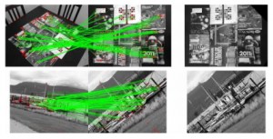
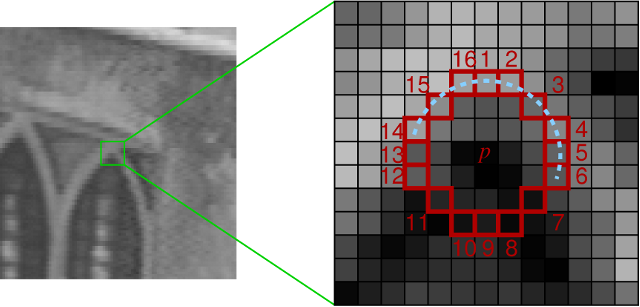
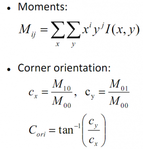
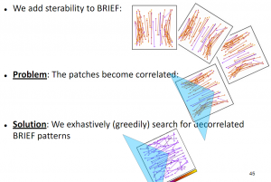
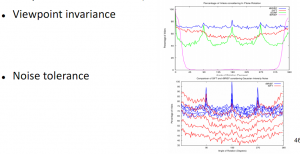
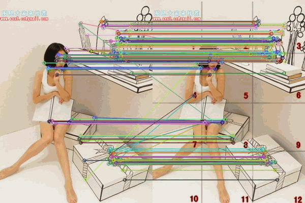
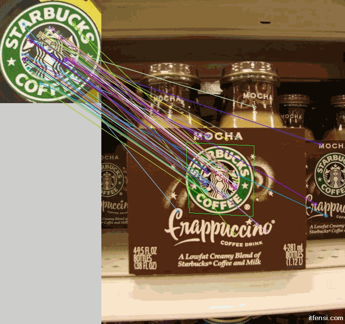

# OpenCV特征点检测------ORB特征

### [    ORB算法](http://blog.csdn.net/sunanger_wang/article/details/7949202)

[](http://www.cvchina.info/wp-content/uploads/2011/07/orb.png)

ORB是是ORiented Brief的简称。ORB的描述在下面文章中：

Ethan Rublee and Vincent Rabaud and Kurt Konolige and Gary Bradski, ORB: an efcient alternative to SIFT or SURF, ICCV 2011

没有加上链接是因为作者确实还没有放出论文，不过OpenCV2.3RC中已经有了实现，WillowGarage有一个talk也提到了这个算法，因此我不揣浅陋，在这里总结一下。

Brief是Binary Robust Independent Elementary Features的缩写。这个特征描述子是由EPFL的Calonder在ECCV2010上提出的。主要思路就是在特征点附近随机选取若干点对，将这些点对的灰度值的大小，组合成一个二进制串，并将这个二进制串作为该特征点的特征描述子。详细算法描述参考如下论文：

[Calonder M., Lepetit V., Strecha C., Fua P.: BRIEF: Binary Robust Independent Elementary Features. ECCV 2010](http://cvlab.epfl.ch/~calonder/CalonderLSF10.pdf)

注意在BRIEF eccv2010的文章中，BRIEF描述子中的每一位是由随机选取的两个像素点做二进制比较得来的。文章同样提到，在此之前，需要选取合适的gaussian kernel对图像做平滑处理。（为什么要强调这一点，因为下述的ORB对此作了改进。）

BRIEF的优点在于速度，缺点也相当明显：

1：不具备旋转不变性。

2：对噪声敏感

3：不具备尺度不变性。

ORB就是试图解决上述缺点中的1和2.

#### 如何解决旋转不变性：

在ORB的方案中，是采用了FAST作为特征点检测算子。FAST应用的很多了，是出名的快，以防有人不知道，请看[这里](http://mi.eng.cam.ac.uk/~er258/work/fast.html)：

[](http://images.cnitblog.com/blog/522070/201503/241718356457074.png)

在Sift的方案中，特征点的主方向是由梯度直方图的最大值和次大值所在的bin对应的方向决定的。略嫌耗时。

在ORB的方案中，特征点的主方向是通过矩（moment）计算而来，公式如下：

[](http://www.cvchina.info/wp-content/uploads/2011/07/oriented_FAST.png)

有了主方向之后，就可以依据该主方向提取BRIEF描述子。但是由此带来的问题是，由于主方向会发生变化，随机点对的相关性会比较大，从而降低描述子的判别性。解决方案也很直接，采取贪婪的，穷举的方法，暴力找到相关性较低的随机点对。

[](http://www.cvchina.info/wp-content/uploads/2011/07/sterable_brief.png)

#### 如何解决对噪声敏感的问题：

在前面提到过，在最早的eccv2010的文章中，BRIEF使用的是pixel跟pixel的大小来构造描述子的每一个bit。这样的后果就是对噪声敏感。因此，在ORB的方案中，做了这样的改进，不再使用pixel-pair，而是使用9×9的patch-pair，也就是说，对比patch的像素值之和。（可以通过积分图快速计算）。

#### 关于尺度不变性：

ORB没有试图解决尺度不变性，（因为FAST本身就不具有尺度不变性。）但是这样只求速度的特征描述子，一般都是应用在实时的视频处理中的，这样的话就可以通过跟踪还有一些启发式的策略来解决尺度不变性的问题。

#### 关于计算速度：

ORB是sift的100倍，是surf的10倍。

#### 关于性能：

下面是一个性能对比，ORB还是很给力。点击看大图。

[](http://www.cvchina.info/wp-content/uploads/2011/07/perf_ORB.png)

[参考Slides](http://www.ais.uni-bonn.de/~holz/spme/talks/01_Bradski_SemanticPerception_2011.pdf)

###### Related posts

- [Android-opencv之CVCamera](http://www.cvchina.info/2011/01/21/android-opencv之cvcamera/) (1)

 

### [最新版的OpenCV中新增加的ORB特征的使用](http://blog.csdn.net/merlin_q/article/details/7026375)


看到OpenCV2.3.1里面ORB特征提取算法也在里面了，套用给的SURF特征例子程序改为ORB特征一直提示错误，类型不匹配神马的，由于没有找到示例程序，只能自己找答案。

（ORB特征论文：ORB： an efficient alternative to SIFT or SURF.[点击下载论文](http://www.willowgarage.com/sites/default/files/orb_final.pdf)）

经过查找发现：

描述符数据类型有是float的，比如说SIFT，SURF描述符，还有是uchar的，比如说有ORB，BRIEF

对于float 匹配方式有：

FlannBased

BruteForce<L2<float> >

BruteForce<SL2<float> >

BruteForce<L1<float> >

对于uchar有：

BruteForce<Hammin>

BruteForce<HammingLUT>

```
BruteForceMatcher< L2<float> > matcher;//改动的地方
```

完整代码如下：

```
#include <iostream>
#include "opencv2/core/core.hpp"
#include "opencv2/features2d/features2d.hpp"
#include "opencv2/highgui/highgui.hpp"
#include <iostream>
#include <vector>
using namespace cv;
using namespace std;
int main()
{
	Mat img_1 = imread("D:\\image\\img1.jpg");
	Mat img_2 = imread("D:\\image\\img2.jpg");
	if (!img_1.data || !img_2.data)
	{
		cout << "error reading images " << endl;
		return -1;
	}

	ORB orb;
	vector<KeyPoint> keyPoints_1, keyPoints_2;
	Mat descriptors_1, descriptors_2;

	orb(img_1, Mat(), keyPoints_1, descriptors_1);
	orb(img_2, Mat(), keyPoints_2, descriptors_2);
	
	BruteForceMatcher<HammingLUT> matcher;
	vector<DMatch> matches;
	matcher.match(descriptors_1, descriptors_2, matches);

	double max_dist = 0; double min_dist = 100;
	//-- Quick calculation of max and min distances between keypoints
	for( int i = 0; i < descriptors_1.rows; i++ )
	{ 
		double dist = matches[i].distance;
		if( dist < min_dist ) min_dist = dist;
		if( dist > max_dist ) max_dist = dist;
	}
	printf("-- Max dist : %f \n", max_dist );
	printf("-- Min dist : %f \n", min_dist );
	//-- Draw only "good" matches (i.e. whose distance is less than 0.6*max_dist )
	//-- PS.- radiusMatch can also be used here.
	std::vector< DMatch > good_matches;
	for( int i = 0; i < descriptors_1.rows; i++ )
	{ 
		if( matches[i].distance < 0.6*max_dist )
		{ 
			good_matches.push_back( matches[i]); 
		}
	}

	Mat img_matches;
	drawMatches(img_1, keyPoints_1, img_2, keyPoints_2,
		good_matches, img_matches, Scalar::all(-1), Scalar::all(-1),
		vector<char>(), DrawMatchesFlags::NOT_DRAW_SINGLE_POINTS);
	imshow( "Match", img_matches);
	cvWaitKey();
	return 0;
}
```

另外: SURF SIFT

/*
SIFT sift;
sift(img_1, Mat(), keyPoints_1, descriptors_1);
sift(img_2, Mat(), keyPoints_2, descriptors_2);
BruteForceMatcher<L2<float> > matcher;
*/
/*
SURF surf;
surf(img_1, Mat(), keyPoints_1);
surf(img_2, Mat(), keyPoints_2);
SurfDescriptorExtractor extrator;
extrator.compute(img_1, keyPoints_1, descriptors_1);
extrator.compute(img_2, keyPoints_2, descriptors_2);
BruteForceMatcher<L2<float> > matcher;
*/

效果：

[](http://images.cnitblog.com/blog/522070/201503/241718532709358.gif)

另外一个是寻找目标匹配

在右边的场景图里面寻找左边那幅图的starbucks标志

效果如下：

[](http://images.cnitblog.com/blog/522070/201503/241718549581674.gif)

需要在之前的那个imshow之前加上如下代码即可完成一个简单的功能展示：

```
	// localize the object
	std::vector<Point2f> obj;
	std::vector<Point2f> scene;

	for (size_t i = 0; i < good_matches.size(); ++i)
	{
		// get the keypoints from the good matches
		obj.push_back(keyPoints_1[ good_matches[i].queryIdx ].pt);
		scene.push_back(keyPoints_2[ good_matches[i].trainIdx ].pt);
	}
	Mat H = findHomography( obj, scene, CV_RANSAC );

	// get the corners from the image_1
	std::vector<Point2f> obj_corners(4);
	obj_corners[0] = cvPoint(0,0);
	obj_corners[1] = cvPoint( img_1.cols, 0);
	obj_corners[2] = cvPoint( img_1.cols, img_1.rows);
	obj_corners[3] = cvPoint( 0, img_1.rows);
	std::vector<Point2f> scene_corners(4);

	perspectiveTransform( obj_corners, scene_corners, H);

	// draw lines between the corners (the mapped object in the scene - image_2)
	line( img_matches, scene_corners[0] + Point2f( img_1.cols, 0), scene_corners[1] + Point2f( img_1.cols, 0),Scalar(0,255,0));
	line( img_matches, scene_corners[1] + Point2f( img_1.cols, 0), scene_corners[2] + Point2f( img_1.cols, 0),Scalar(0,255,0));
	line( img_matches, scene_corners[2] + Point2f( img_1.cols, 0), scene_corners[3] + Point2f( img_1.cols, 0),Scalar(0,255,0));
	line( img_matches, scene_corners[3] + Point2f( img_1.cols, 0), scene_corners[0] + Point2f( img_1.cols, 0),Scalar(0,255,0));
```

 

 

 

代码片：

 

 

```cpp
#include "opencv2/highgui/highgui.hpp" 


#include "opencv2/features2d/features2d.hpp" 


#include <iostream> 


 


int main( )  


{  


   cv::Ptr<cv::FeatureDetector> detector = cv::FeatureDetector::create( "SIFT" );  


   cv::Ptr<cv::DescriptorExtractor> extractor = cv::DescriptorExtractor::create("SIFT" );  


   cv::Mat im = cv::imread("box.png", CV_LOAD_IMAGE_COLOR );  


   std::vector<cv::KeyPoint> keypoints;  


   cv::Mat descriptors;  


   detector->detect( im, keypoints);  


   extractor->compute( im,keypoints,descriptors);  


 


int duplicateNum = 0;  


for (int i=0;i<keypoints.size();i++)  


   {  


for (int j=i+1;j<keypoints.size();j++)  


      {  


float dist = abs((keypoints[i].pt.x-keypoints[j].pt.x))+abs((keypoints[i].pt.y-keypoints[j].pt.y));  


if (dist == 0)  


         {  


            cv::Mat descriptorDiff = descriptors.row(i)-descriptors.row(j);  


double diffNorm = cv::norm(descriptorDiff);  


            std::cout<<"keypoint "<<i<<" equal to keypoint "<<j<<" descriptor distance "<<diffNorm<<std::endl;  


            duplicateNum++;  


         }  


      }  


   }  


   std::cout<<"Total keypoint: "<<keypoints.size()<<", duplicateNum: "<<duplicateNum<<std::endl;  


 


return 1;  


}  
```