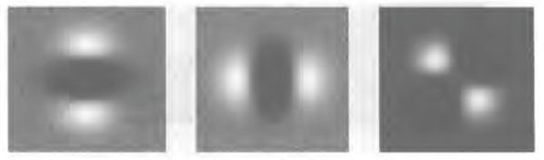
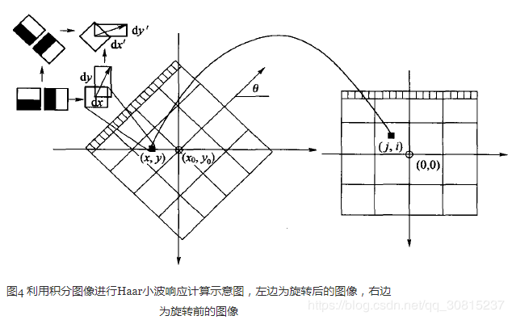

## SURF

https://blog.csdn.net/qq_30815237/article/details/86545950


SURF（Speeded Up Robust Features）是对SIFT的一种改进，主要特点是快速。SURF与SIFT主要有以下几点不同处理：

   1、 SIFT在构造DOG金字塔以及求DOG局部空间极值比较耗时，SURF的改进是使用Hessian矩阵变换图像，极值的检测只需计算Hessian矩阵行列式，作为进一步优化，使用一个简单的方程可以求出Hessian行列式近似值，使用盒状模糊滤波（box blur）求高斯模糊近似值。

   2、 SURF不使用降采样，通过保持图像大小不变，但改变盒状滤波器的大小来构建尺度金字塔。

​    3、在计算关键点主方向以及关键点周边像素方向的方法上，SURF不使用直方图统计，而是使用哈尔(haar)小波转换。SIFT的KPD达到128维，导致KPD的比较耗时，SURF使用哈尔(haar)小波转换得到的方向，让SURF的KPD降到64维，减少了一半，提高了匹配速度

​      如果说SIFT算法中使用DOG对LOG进行了简化，提高了搜索特征点的速度，那么SURF算法则是对DoH的简化与近似。虽然SIFT算法已经被认为是最有效的，也是最常用的特征点提取的算法，但如果不借助于硬件的加速和专用图像处理器的配合，SIFT算法以现有的计算机仍然很难达到实时的程度。对于需要实时运算的场合，如基于特征点匹配的实时目标跟踪系统，每秒要处理8-24帧的图像，需要在毫秒级内完成特征点的搜索、特征矢量生成、特征矢量匹配、目标锁定等工作，这样SIFT算法就很难适应这种需求了。SURF借鉴了SIFT中简化近似的思想，把DoH中的高斯二阶微分模板进行了简化，使得模板对图像的滤波只需要进行几个简单的加减法运算，并且，这种运算与滤波器的尺度无关。实验证明，SURF算法较SIFT在运算速度上要快3倍左右。

# 1. 积分图像

SURF算法中要用到积分图像的概念。借助积分图像，图像与高斯二阶微分模板的滤波转化为对积分图像的加减运算。

积分图像中任意一点(i,j)的值，为原图像左上角到点(i,j)相应的对角线区域灰度值的总和，即

​                   

式中，p(r,c)表示图像中点(r,c)的灰度值，可以用下面两式迭代计算得到

​                   

式中，S(i,j)表示一列的积分，且S(i,−1)=0 ,=0。求积分图像，只需要对原图像所有像素进行一遍扫描。

OpenCV中提供了用于计算积分图像的接口

```cpp
*src :输入图像，大小为M*N


* sum: 输出的积分图像，大小为（M+1）*（N+1）


* sdepth：用于指定sum的类型，-1表示与src类型一致


*/


void integral(InputArray src, OutputArray sum, int sdepth = -1);
```

  值得注意的是OpenCV里的积分图大小比原图像多一行一列，那是因为OpenCV中积分图的计算公式为：
                   
 一旦积分图计算好了，计算图像内任何矩形区域的像素值的和只需要三个加法，如下图所示：
            

# 2. DoH近似

   surf构造的金字塔图像与sift有很大不同，Sift采用的是DOG图像，而**surf采用的是Hessian矩阵行列式近似值图像。** 

  Hessian矩阵是Surf算法的核心，构建Hessian矩阵的目的是为了生成图像稳定的边缘点（突变点），为下文的特征提取做好基础。每一个像素点都可以求出一个Hessian矩阵：

​                 

  当Hessian矩阵的判别式取得局部极大值时，判定当前点是比周围邻域内其他点更亮或更暗的点，由此来定位关键点的位置，Hessian矩阵的判别式为：

​                   ，

   在SURF算法中，图像像素l(x，y)即为函数值f(x，y)。但是由于我们的特征点需要具备尺度无关性，所以在进行Hessian矩阵构造前，需要对其进行高斯滤波，选用二阶标准高斯函数作为滤波器 。通过特定核间的卷积计算二阶偏导数，这样便能计算出H矩阵的三个矩阵元素L_xx, L_xy, L_yy从而计算出H矩阵，在点x处，尺度为σ的Hessian矩阵H(x,σ)定义如下：

​                        

式中，是高斯二阶微分 在在像素点（x,y）处与图像函数I(x,y)的卷积。

下面显示的是上面三种高斯微分算子的图形。

​               

​    但是利用Hessian行列式进行图像斑点检测时，有一个缺点。由于二阶高斯微分被离散化和裁剪的原因，导致了图像在旋转奇数倍的时，即转换到模板的对角线方向时，特征点检测的重复性降低（也就是说，原来特征点的地方，可能检测不到特征点了）。而在时，特征点检测的重现率真最高。但这一小小的不足不影响我们使用Hessian矩阵进行特征点的检测。

### 盒式滤波器

  由于高斯核是服从正态分布的，从中心点往外，系数越来越低，为了提高运算速度，Surf使用了盒式滤波器来近似替代高斯滤波器，提高运算速度。 **盒式滤波器（Boxfilter）对图像的滤波转化成计算图像上不同区域间像素和的加减运算问题，只需要简单几次查找积分图就可以完成。**每个像素的Hessian矩阵行列式的近似值： ，在Dxy上乘了一个加权系数0.9，目的是为了平衡因使用盒式滤波器近似所带来的误差。

  **高斯函数的高阶微分与离散的图像函数I(x,y)做卷积运算时相当于使用高斯滤波模板对图像做滤波处理。**

  在实际运用中，高斯二阶微分进行离散化和裁剪处理得到盒子滤波器近似代替高斯滤波板进行卷积计算，我们需要对高斯二阶微分模板进行简化，使得简化后的模板只是由几个矩形区域组成，矩形区域内填充同一值，如下图所示，在简化模板中白色区域的值为正数，黑色区域的值为负数，灰度区域的值为0。

  

   对于σ=1.2的**高斯二阶微分滤波器**，我们设定模板的尺寸为9×9的大小，并用它作为最小尺度空间值对图像进行滤波和斑点检测。我们使用Dxx、Dxy和Dyy表示模板与图像进行卷积的结果。这样，便可以将Hessian矩阵的行列式作如下的简化：

​           

  滤波器响应的相关权重w是为了平衡Hessian行列式的表示式。这是为了保持高斯核与近似高斯核的一致性。

​                       

  其中为Frobenius范数。理论上来说对于不同的σ的值和对应尺寸的模板尺寸，w值是不同的，但为了简化起见，可以认为它是同一个常数。

​    **使用近似的Hessian矩阵行列式来表示图像中某一点x处的斑点响应值，**遍历图像中所有的像元点，便形成了在某一尺度下关键点检测的响应图像。**使用不同的模板尺寸，便形成了多尺度斑点响应的金字塔图像**，利用这一金字塔图像，就可以进行斑点响应极值点的搜索，其过程完全与SIFT算法类同。

# 3. 尺度空间表示

   通常想要获取不同尺度的斑点，必须建立图像的尺度空间金字塔。一般的方法是通过不同σ的高斯函数，对图像进行平滑滤波，然后重采样图像以获得更高一层的金字塔图像。SIFT特征检测算法中就是通过相邻两层图像金字塔相减得到DoG图像，然后再在DoG图像上进行斑点和边缘检测工作的。

   由于采用了盒子滤波和积分图像，所以，我们并不需要像SIFT算法那样去直接建立图像金字塔，而是采用不断增大盒子滤波模板的尺寸的间接方法。通过不同尺寸盒子滤波模板与积分图像求取Hessian矩阵行列式的响应图像。然后在响应图像上采用3D非最大值抑制，求取各种不同尺度的斑点。

   如前所述，我们使用9×9的模板对图像进行滤波，其结果作为最初始的尺度空间层（此时，尺度值为s=1.2，近似σ=1.2的高斯微分），后续的层将通过逐步放大滤波模板尺寸，以及放大后的模板不断与图像进行滤波得到。由于采用盒子滤波和积分图像，滤波过程并不随着滤波模板尺寸的增加而使运算工作量增加。

   与SIFT算法类似，我们需要将尺度空间划分为若干组（Octaves）。一个组代表了逐步放大的滤波模板对同一输入图像进行滤波的一系列响应图。每个组又由若干固定的层组成。由于积分图像离散化的原因，两个层之间的最小尺度变化量是由高斯二阶微分滤波器在微分方向上对正负斑点响应长度决定的，它是盒子滤波器模板尺寸的1/3。对于9×9的模板，它的=3。下一层的响应长度至少应该在的基础上增加2个像素，以保证一边一个像素，即=5。这样模板的尺寸就为15×15。以此类推，我们可以得到一个尺寸增大模板序列，它们的尺寸分别为：9×9，15×15，21×21，27×279×9，15×15，21×21，27×27，黑色、白色区域的长度增加偶数个像素，以保证一个中心像素的存在。

​                   

   采用类似的方法来处理其他几组的模板序列。其方法是将滤波器尺寸增加量翻倍（6，12，24，38）。这样，可以得到第二组的滤波器尺寸，它们分别为15，27，39，51。第三组的滤波器尺寸为27，51，75，99。如果原始图像的尺寸仍然大于对应的滤波器尺寸，尺度空间的分析还可以进行第四组，其对应的模板尺寸分别为51，99，147和195。下图显示了第一组至第三组的滤波器尺寸变化。

​                      

  在通常尺度分析情况下，随着尺度的增大，被检测到的斑点数量迅速衰减。所以一般进行3-4组就可以了，与此同时，为了减少运算量，提高计算的速度，可以考虑在滤波时，将采样间隔设为2。

  对于尺寸为L的模板，当用它与积分图运算来近似二维高斯核的滤波时，对应的二维高斯核的参数σ=1.2×(L/9)，这一点至关重要，尤其是在后面计算描述子时，用于计算邻域的半径时。

### Hessian行列式图像的产生过程

   在SURF算法的尺度空间中，每一组中任意一层包括三种盒子滤波器。对一幅输入图像进行滤波后通过Hessian行列式计算公式可以得到对于尺度坐标下的Hessian行列式的值，所有Hessian行列式值构成一幅Hessian行列式图像。


## 4. 兴趣点的定位

   为了在图像及不同尺寸中定位兴趣点，我们用了3×3×3邻域非最大值抑制。具体的步骤基本与SIFT一致，而且Hessian矩阵行列式的最大值在尺度和图像空间被插值。

   总体来说，如果理解了SIFT算法，再来看SURF算法会发现思路非常简单。尤其是局部最大值查找方面，基本一致。关键还是一个用积分图来简化卷积的思路，以及怎么用不同的模板来近似原来尺度空间中的高斯滤波器。

## 5. SURF特征点方向分配

​    为了保证特征矢量具有旋转不变性，与SIFT特征一样，需要对每个特征点分配一个主方向。为些，我们需要以特征点为中心，**以6\*s（s=1.2∗L/9为特征点的尺度）为半径的圆形区域，对图像进行Haar小波响应运算**。这样做实际就是对图像进行梯度运算只不过是我们需要利用积分图像，提高计算图像梯度的效率。在SIFT特征描述子中我们在求取特征点主方向时，以是特征点为中心，在以4.5σ为半径的邻域内计算梯度方向直方图。事实上，两种方法在求取特征点主方向时，考虑到Haar小波的模板带宽，实际计算梯度的图像区域是相同的。用于计算梯度的Harr小波的尺度为4s。

​                     

   其中左侧模板计算X方向的响应，右侧模板计算y方向的响应，黑色表示-1，白色表示+1。用其对圆形领域进行处理后，就得**到了该领域内每个点对应的x,y方向的响应，然后用以兴趣点为中心的高斯函数（）对这些响应进行加权。**

   为了求取主方向值，需要设计一个以特征点为中心，张角为60度的扇形滑动窗口，统计这个扇形区域内的haar小波特征总和。以步长为0.2弧度左右，旋转这个滑动窗口，再统计小波特征总和。小波特征总和最大的方向为主方向。特征总和的求法是对图像Harr小波响应值dx、dy进行累加，得到一个矢量：

​                      

主方向为最大Harr响应累加值所对应的方向，也就是最长矢量所对应的方向，即

​                        

   可以依照SIFT求方向时策略，当存在另一个相当于主峰值80%能量的峰值时，则将这个方向认为是该特征点的辅方向。一个特征点可能会被指定具有多个方向（一个主方向，一个以上辅方向），这可以增强匹配的鲁棒性。和SIFT的描述子类似，如果在中出现另一个大于主峰能量![max[m_{w}]](pic/gif-1590120314024.gif)的80%时的次峰，可以将该特征点复制成两个特征点。一个主的方向为最大响应能量所对应的方向，另一个主方向为次大响应能量所对应的方向。

​        

### 5.1 特征点特征矢量生成

  在SIFT中关键点描述是选取了关键点周围16*16的领域，又将其划分为4*4的区域，每个区域统计8个方向梯度，最后得到4*4*8=128维度的描述向量。

  SURF中，我们在关键点周围选取一个正方形框，方向为关键点的主方向，边长为20S。将其划分为16个区域（边长为5S），每个区域统计25个像素的水平方向和垂直方向的Haar小波特性（均相对于正方形框的主方向确定的）

   生成特征点描述子，需要计算图像的Haar小波响应。在一个矩形区域来计算Haar小波响应。以特征点为中心，沿上一节讨论得到的主方向，沿主方向将20s×20s的图像划分为4×4个子块，**每个子块利用尺寸2s的Harr模板进行响应值计算**，然后对响应值进**行统计∑dx、∑|dx|、∑dy、∑|dy|形成特征矢量**。如下图2所示。图中，以特征点为中心，以20s为边长的矩形窗口为特征描述子计算使用的窗口，特征点到矩形边框的线段表示特征点的主方向。

​                      

   将20s的窗口划分成4×4子窗口，每个子窗口有5s×5s个像素。使用尺寸为2s的Harr小波对子窗口图像进行其响应值计算，共进行25次采样，分别得到沿主方向的dy和垂直于主方向的dx。然后，以特征点为中心，对dy和dx进行高斯加权计算，高斯核的参数为σ=3.3s(即20s/6)。最后分别对每个子块的响应值进行统计，得到每个子块的矢量：

​                     

   由于共有4×4个子块，因此，**特征描述子共由4×4×4=64维特征矢量组成。SURF描述子不仅具有尺度和旋转不变性，而且对光照的变化也具有不变性。**使小波响应本身就具有亮度不变性，而对比度的不变性则是通过将特征矢量进行归一化来实现。图3 给出了三种不同图像模式的子块得到的不同结果。对于实际图像的描述子，我们可以认为它们是由这三种不同模式图像的描述子组合而成的。

​               

   为了充分利用积分图像进行Haar小波的响应计算，我们并不直接旋转Haar小波模板求得其响应值，而是在积图像上先使用水平和垂直的Haar模板求得响应值dy和dx，然后根据主方向旋转dx和dy与主方向操持一致，如下图4所示。为了求得旋转后Haar小波响应值，首先要得到旋转前图像的位置。旋转前后图偈的位置关系，可以通过点的旋转公式得到：

​                       

  在得到点(j,i)在旋转前对应积分图像的位置(x,y)后，利用积分图像与水平、垂直Harr小波，求得水平与垂直两个方向的响应值dx和dy。对dx和dy进行高斯加权处理，并根据主方向的角度，对dx和dy进行旋转变换，从而，得到旋转后的dx’和dy’。其计算公式如下：

​                           

​             

### 5.2 特征描述子的维数

   一般而言，特征矢量的长度越长，特征矢量所承载的信息量就越大，特征描述子的独特性就越好，但匹配时所付出的时间代价就越大。对于SURF描述子，可以将它扩展到用128维矢量来表示。具体方法是在求∑dx、∑|dx|时区分dy<0和dy≥0情况。同时，在求取∑dy、∑|dy|时区分dx<0和dx≥0情况。这样，每个子块就产生了8个梯度统计值，从而使描述子特征矢量的长度增加到8×4×4=128维。

​    为了实现快速匹配，SURF在特征矢量中增加了一个新的变量，即特征点的拉普拉斯响应正负号。在特征点检测时，将Hessian矩阵的迹的正负号记录下来，作为特征矢量中的一个变量。这样做并不增加运算量，因为特征点检测进已经对Hessian矩阵的迹进行了计算。在特征匹配时，这个变量可以有效地节省搜索的时间，因为只有两个具有相同正负号的特征点才有可能匹配，对于正负号不同的特征点就不进行相似性计算。

​    简单地说，我们可以根据特征点的响应值符号，将特征点分成两组，一组是具有拉普拉斯正响应的特征点，一组是具有拉普拉斯负响应的特征点，匹配时，只有符号相同组中的特征点才能进行相互匹配。显然，这样可以节省特征点匹配的时间。如下图5所示。

​               

   实际上有文献指出，SURF比SIFT工作更出色。他们认为主要是因为SURF在求取描述子特征矢量时，是对一个子块的梯度信息进行求和，而SIFT则是依靠单个像素梯度的方向。

# SURF算法与SIFT算法总结对比

（1）在生成尺度空间方面，SIFT算法利用的是差分高斯金字塔与不同层级的空间图像相互卷积生成。SURF算法采用的是不同尺度的box filters与原图像卷积

（2）在特征点检验时，SIFT算子是先对图像进行非极大值抑制，再去除对比度较低的点。然后通过Hessian矩阵去除边缘的点。

而SURF算法是先通过Hessian矩阵来检测候选特征点，然后再对非极大值的点进行抑制

（3）在特征向量的方向确定上，SIFT算法是在正方形区域内统计梯度的幅值的直方图，找到最大梯度幅值所对应的方向。SIFT算子确定的特征点可以有一个或一个以上方向，其中包括一个主方向与多个辅方向。

SURF算法则是在圆形邻域内，检测各个扇形范围内水平、垂直方向上的Haar小波响应，找到模值最大的扇形指向，且该算法的方向只有一个。

（4）SIFT算法生成描述子时，是将16*16的采样点划分为4*4的区域，从而计算每个分区种子点的幅值并确定其方向，共计4*4*8=128维。

SURF算法在生成特征描述子时将20s*20s的正方形分割成4*4的小方格，每个子区域25个采样点，计算小波haar响应，一共4*4*4=64维。

综上，SURF算法在各个步骤上都简化了一些繁琐的工作，仅仅计算了特征点的一个主方向，生成的特征描述子也与前者相比降低了维数。

from：https://www.cnblogs.com/gfgwxw/p/9415218.html

——————————————————————————————————————————

# SUFT源码解析

这份源码来自OpenCV nonfree模块。

## 1 主干函数 fastHessianDetector

   特征点定位的主干函数为fastHessianDetector，该函数接受一个积分图像，以及尺寸相关的参数，组数与每组的层数，检测到的特征点保存在vector<KeyPoint>类型的结构中。

```cpp
static void fastHessianDetector(const Mat& sum, const Mat& msum, vector<KeyPoint>& keypoints,


    int nOctaves, int nOctaveLayers, float hessianThreshold)


{


    /*first Octave图像采样的步长，第二组的时候加倍，以此内推


    增加这个值，将会加快特征点检测的速度，但是会让特征点的提取变得不稳定*/


    const int SAMPLE_STEP0 = 1;


 


    int nTotalLayers = (nOctaveLayers + 2)*nOctaves; // 尺度空间的总图像数


    int nMiddleLayers = nOctaveLayers*nOctaves; // 用于检测特征点的层的 总数，也就是中间层的总数


 


    vector<Mat> dets(nTotalLayers); // 每一层图像 对应的 Hessian行列式的值


    vector<Mat> traces(nTotalLayers); // 每一层图像 对应的 Hessian矩阵的迹的值


    vector<int> sizes(nTotalLayers); // 每一层用的 Harr模板的大小


    vector<int> sampleSteps(nTotalLayers); // 每一层用的采样步长 


    vector<int> middleIndices(nMiddleLayers); // 中间层的索引值


 


    keypoints.clear();


 


    // 为上面的对象分配空间，并赋予合适的值


    int index = 0, middleIndex = 0, step = SAMPLE_STEP0;


 


    for (int octave = 0; octave < nOctaves; octave++)


    {


        for (int layer = 0; layer < nOctaveLayers + 2; layer++)


        {


            /*这里sum.rows - 1是因为 sum是积分图，它的大小是原图像大小加1*/


            dets[index].create((sum.rows - 1) / step, (sum.cols - 1) / step, CV_32F); // 这里面有除以遍历图像用的步长


            traces[index].create((sum.rows - 1) / step, (sum.cols - 1) / step, CV_32F);


            sizes[index] = (SURF_HAAR_SIZE0 + SURF_HAAR_SIZE_INC*layer) << octave;


            sampleSteps[index] = step;


 


            if (0 < layer && layer <= nOctaveLayers)


                middleIndices[middleIndex++] = index;


            index++;


        }


        step *= 2;


    }


    // Calculate hessian determinant and trace samples in each layer


    for (int i = 0; i < nTotalLayers; i++)


    {


        calcLayerDetAndTrace(sum, sizes[i], sampleSteps[i], dets[i], traces[i]);


    }


 


    // Find maxima in the determinant of the hessian


    for (int i = 0; i < nMiddleLayers; i++)


    {


        int layer = middleIndices[i];


        int octave = i / nOctaveLayers;


        findMaximaInLayer(sum, msum, dets, traces, sizes, keypoints, octave, layer, hessianThreshold, sampleSteps[layer]);


    }


 


    std::sort(keypoints.begin(), keypoints.end(), KeypointGreater());


}
```

## 2 计算Hessian矩阵的行列式与迹calcLayerDetAndTrace

   这个函数首先定义了尺寸为9的第一层图像的三个模板。模板分别为一个3×5、3×5、4×5的二维数组表示，数组的每一行表示一个黑白块的位置参数。函数里只初始化了第一层图像的模板参数，后面其他组其他层的Harr模板参数都是用resizeHaarPattern 这个函数来计算的。这个函数返回的是一个SurfHF的结构体，这个结构体由两个点及一个权重构成。

```cpp
struct SurfHF


{


    int p0, p1, p2, p3;


    float w;


 


    SurfHF() : p0(0), p1(0), p2(0), p3(0), w(0) {}


};
```

resizeHaarPattern这个函数非常的巧妙，它把模板中的点坐标。转换到在积分图中的相对（模板左上角点）坐标。

```cpp
static void


resizeHaarPattern(const int src[][5], SurfHF* dst, int n, int oldSize, int newSize, int widthStep)


{


    float ratio = (float)newSize / oldSize;


    for (int k = 0; k < n; k++)


    {


        int dx1 = cvRound(ratio*src[k][0]);


        int dy1 = cvRound(ratio*src[k][1]);


        int dx2 = cvRound(ratio*src[k][2]);


        int dy2 = cvRound(ratio*src[k][3]);


        /*巧妙的坐标转换*/


        dst[k].p0 = dy1*widthStep + dx1; // 转换为一个相对距离，距离模板左上角点的  在积分图中的距离 !!important!!


        dst[k].p1 = dy2*widthStep + dx1; 


        dst[k].p2 = dy1*widthStep + dx2;


        dst[k].p3 = dy2*widthStep + dx2;


        dst[k].w = src[k][4] / ((float)(dx2 - dx1)*(dy2 - dy1));// 原来的+1,+2用 覆盖的所有像素点平均。


    }


}
```

在用积分图计算近似卷积时，用的是calcHaarPattern函数。这个函数比较简单，只用知道左上与右下角坐标即可。

```cpp
inline float calcHaarPattern(const int* origin, const SurfHF* f, int n)


{


    /*orgin即为积分图，n为模板中 黑白 块的个数 */


    double d = 0;


    for (int k = 0; k < n; k++)


        d += (origin[f[k].p0] + origin[f[k].p3] - origin[f[k].p1] - origin[f[k].p2])*f[k].w;


    return (float)d;


}
```

最终我们可以看到了整个calcLayerDetAndTrack的代码

```cpp
static void calcLayerDetAndTrace(const Mat& sum, int size, int sampleStep,


    Mat& det, Mat& trace)


{


    const int NX = 3, NY = 3, NXY = 4;


    const int dx_s[NX][5] = { { 0, 2, 3, 7, 1 }, { 3, 2, 6, 7, -2 }, { 6, 2, 9, 7, 1 } };


    const int dy_s[NY][5] = { { 2, 0, 7, 3, 1 }, { 2, 3, 7, 6, -2 }, { 2, 6, 7, 9, 1 } };


    const int dxy_s[NXY][5] = { { 1, 1, 4, 4, 1 }, { 5, 1, 8, 4, -1 }, { 1, 5, 4, 8, -1 }, { 5, 5, 8, 8, 1 } };


 


    SurfHF Dx[NX], Dy[NY], Dxy[NXY];


 


    if (size > sum.rows - 1 || size > sum.cols - 1)


        return;


    resizeHaarPattern(dx_s, Dx, NX, 9, size, sum.cols);


    resizeHaarPattern(dy_s, Dy, NY, 9, size, sum.cols);


    resizeHaarPattern(dxy_s, Dxy, NXY, 9, size, sum.cols);


 


    /* The integral image 'sum' is one pixel bigger than the source image */


    int samples_i = 1 + (sum.rows - 1 - size) / sampleStep; // 最大能遍历到的 行坐标，因为要减掉一个模板的尺寸


    int samples_j = 1 + (sum.cols - 1 - size) / sampleStep; // 最大能遍历到的 列坐标


 


    /* Ignore pixels where some of the kernel is outside the image */


    int margin = (size / 2) / sampleStep;


 


    for (int i = 0; i < samples_i; i++)


    {


        /*坐标为(i,j)的点是模板左上角的点，所以实际现在模板分析是的i+margin,j+margin点处的响应*/


        const int* sum_ptr = sum.ptr<int>(i*sampleStep);


        float* det_ptr = &det.at<float>(i + margin, margin); // 左边空隙为 margin


        float* trace_ptr = &trace.at<float>(i + margin, margin);


        for (int j = 0; j < samples_j; j++)


        {


            float dx = calcHaarPattern(sum_ptr, Dx, 3);


            float dy = calcHaarPattern(sum_ptr, Dy, 3);


            float dxy = calcHaarPattern(sum_ptr, Dxy, 4);


            sum_ptr += sampleStep;


            det_ptr[j] = dx*dy - 0.81f*dxy*dxy;


            trace_ptr[j] = dx + dy;


        }


    }


}
```

## 3 局部最大值搜索findMaximaInLayer

这里算法思路很简单，值得注意的是里面的一些坐标的转换很巧妙，里面比较重的函数就是interpolateKeypoint函数，通过插值计算最大值点。

```cpp
/*


* Maxima location interpolation as described in "Invariant Features from


* Interest Point Groups" by Matthew Brown and David Lowe. This is performed by


* fitting a 3D quadratic to a set of neighbouring samples.


*


* The gradient vector and Hessian matrix at the initial keypoint location are


* approximated using central differences. The linear system Ax = b is then


* solved, where A is the Hessian, b is the negative gradient, and x is the


* offset of the interpolated maxima coordinates from the initial estimate.


* This is equivalent to an iteration of Netwon's optimisation algorithm.


*


* N9 contains the samples in the 3x3x3 neighbourhood of the maxima


* dx is the sampling step in x


* dy is the sampling step in y


* ds is the sampling step in size


* point contains the keypoint coordinates and scale to be modified


*


* Return value is 1 if interpolation was successful, 0 on failure.


*/


 


static int


interpolateKeypoint(float N9[3][9], int dx, int dy, int ds, KeyPoint& kpt)


{


    Vec3f b(-(N9[1][5] - N9[1][3]) / 2,  // Negative 1st deriv with respect to x


        -(N9[1][7] - N9[1][1]) / 2,  // Negative 1st deriv with respect to y


        -(N9[2][4] - N9[0][4]) / 2); // Negative 1st deriv with respect to s


 


    Matx33f A(


        N9[1][3] - 2 * N9[1][4] + N9[1][5],            // 2nd deriv x, x


        (N9[1][8] - N9[1][6] - N9[1][2] + N9[1][0]) / 4, // 2nd deriv x, y


        (N9[2][5] - N9[2][3] - N9[0][5] + N9[0][3]) / 4, // 2nd deriv x, s


        (N9[1][8] - N9[1][6] - N9[1][2] + N9[1][0]) / 4, // 2nd deriv x, y


        N9[1][1] - 2 * N9[1][4] + N9[1][7],            // 2nd deriv y, y


        (N9[2][7] - N9[2][1] - N9[0][7] + N9[0][1]) / 4, // 2nd deriv y, s


        (N9[2][5] - N9[2][3] - N9[0][5] + N9[0][3]) / 4, // 2nd deriv x, s


        (N9[2][7] - N9[2][1] - N9[0][7] + N9[0][1]) / 4, // 2nd deriv y, s


        N9[0][4] - 2 * N9[1][4] + N9[2][4]);           // 2nd deriv s, s


 


    Vec3f x = A.solve(b, DECOMP_LU);


 


    bool ok = (x[0] != 0 || x[1] != 0 || x[2] != 0) &&


        std::abs(x[0]) <= 1 && std::abs(x[1]) <= 1 && std::abs(x[2]) <= 1;


 


    if (ok)


    {


        kpt.pt.x += x[0] * dx;


        kpt.pt.y += x[1] * dy;


        kpt.size = (float)cvRound(kpt.size + x[2] * ds);


    }


    return ok;


}


 


static void findMaximaInLayer(const Mat& sum, const Mat& mask_sum,


    const vector<Mat>& dets, const vector<Mat>& traces,


    const vector<int>& sizes, vector<KeyPoint>& keypoints,


    int octave, int layer, float hessianThreshold, int sampleStep)


{


    // Wavelet Data


    const int NM = 1;


    const int dm[NM][5] = { { 0, 0, 9, 9, 1 } };


    SurfHF Dm;


 


    int size = sizes[layer];


 


    // 当前层图像的大小


    int layer_rows = (sum.rows - 1) / sampleStep;


    int layer_cols = (sum.cols - 1) / sampleStep;


 


    // 边界区域大小，考虑的下一层的模板大小


    int margin = (sizes[layer + 1] / 2) / sampleStep + 1;


 


    if (!mask_sum.empty())


        resizeHaarPattern(dm, &Dm, NM, 9, size, mask_sum.cols);


 


    int step = (int)(dets[layer].step / dets[layer].elemSize());


 


    for (int i = margin; i < layer_rows - margin; i++)


    {


        const float* det_ptr = dets[layer].ptr<float>(i);


        const float* trace_ptr = traces[layer].ptr<float>(i);


        for (int j = margin; j < layer_cols - margin; j++)


        {


            float val0 = det_ptr[j]; // 中心点的值


            if (val0 > hessianThreshold)


            {


                // 模板左上角的坐标


                int sum_i = sampleStep*(i - (size / 2) / sampleStep);


                int sum_j = sampleStep*(j - (size / 2) / sampleStep);


 


                /* The 3x3x3 neighbouring samples around the maxima.


                The maxima is included at N9[1][4] */


 


                const float *det1 = &dets[layer - 1].at<float>(i, j);


                const float *det2 = &dets[layer].at<float>(i, j);


                const float *det3 = &dets[layer + 1].at<float>(i, j);


                float N9[3][9] = { { det1[-step - 1], det1[-step], det1[-step + 1],


                    det1[-1], det1[0], det1[1],


                    det1[step - 1], det1[step], det1[step + 1] },


                    { det2[-step - 1], det2[-step], det2[-step + 1],


                    det2[-1], det2[0], det2[1],


                    det2[step - 1], det2[step], det2[step + 1] },


                    { det3[-step - 1], det3[-step], det3[-step + 1],


                    det3[-1], det3[0], det3[1],


                    det3[step - 1], det3[step], det3[step + 1] } };


 


                /* Check the mask - why not just check the mask at the center of the wavelet? */


                if (!mask_sum.empty())


                {


                    const int* mask_ptr = &mask_sum.at<int>(sum_i, sum_j);


                    float mval = calcHaarPattern(mask_ptr, &Dm, 1);


                    if (mval < 0.5)


                        continue;


                }


 


                /* 检测val0，是否在N9里极大值，？？为什么不检测极小值呢*/


                if (val0 > N9[0][0] && val0 > N9[0][1] && val0 > N9[0][2] &&


                    val0 > N9[0][3] && val0 > N9[0][4] && val0 > N9[0][5] &&


                    val0 > N9[0][6] && val0 > N9[0][7] && val0 > N9[0][8] &&


                    val0 > N9[1][0] && val0 > N9[1][1] && val0 > N9[1][2] &&


                    val0 > N9[1][3] && val0 > N9[1][5] &&


                    val0 > N9[1][6] && val0 > N9[1][7] && val0 > N9[1][8] &&


                    val0 > N9[2][0] && val0 > N9[2][1] && val0 > N9[2][2] &&


                    val0 > N9[2][3] && val0 > N9[2][4] && val0 > N9[2][5] &&


                    val0 > N9[2][6] && val0 > N9[2][7] && val0 > N9[2][8])


                {


                    /* Calculate the wavelet center coordinates for the maxima */


                    float center_i = sum_i + (size - 1)*0.5f;


                    float center_j = sum_j + (size - 1)*0.5f;


 


                    KeyPoint kpt(center_j, center_i, (float)sizes[layer],


                        -1, val0, octave, CV_SIGN(trace_ptr[j]));


 


                    /* 局部极大值插值，用Hessian，类似于SIFT里的插值，里面没有迭代5次，只进行了一次查找，why?  */


                    int ds = size - sizes[layer - 1];


                    int interp_ok = interpolateKeypoint(N9, sampleStep, sampleStep, ds, kpt);


 


                    /* Sometimes the interpolation step gives a negative size etc. */


                    if (interp_ok)


                    {


                        /*printf( "KeyPoint %f %f %d\n", point.pt.x, point.pt.y, point.size );*/


                        keypoints.push_back(kpt);


                    }


                }


            }


        }


    }


}
```

## 4 特征点描述子生成

特征点描述子的生成这一部分的代码主要是通过SURFInvoker这个类来实现。在主流程中，通过一个parallel_for_()函数来并发计算。

```cpp
struct SURFInvoker


{


    enum{ORI_RADIUS = 6, ORI_WIN = 60, PATCH_SZ = 20};


    // Parameters


    const Mat* img;


    const Mat* sum;


    vector<KeyPoint>* keypoints;


    Mat* descriptors;


    bool extended;


    bool upright;


 


    // Pre-calculated values


    int nOriSamples;


    vector<Point> apt; // 特征点周围用于描述方向的邻域的点


    vector<float> aptw; // 描述 方向时的 高斯 权


    vector<float> DW;


 


 


    SURFInvoker(const Mat& _img, const Mat& _sum,


        vector<KeyPoint>& _keypoints, Mat& _descriptors,


        bool _extended, bool _upright)


    {


        keypoints = &_keypoints;


        descriptors = &_descriptors;


        img = &_img;


        sum = &_sum;


        extended = _extended;


        upright = _upright;


 


        // 用于描述特征点的 方向的 邻域大小： 12*sigma+1 (sigma =1.2) 因为高斯加权的核的参数为2sigma


        // nOriSampleBound为 矩形框内点的个数


        const int nOriSampleBound = (2 * ORI_RADIUS + 1)*(2 * ORI_RADIUS + 1); // 这里把s近似为1 ORI_DADIUS = 6s


 


        // 分配大小 


        apt.resize(nOriSampleBound);


        aptw.resize(nOriSampleBound);


        DW.resize(PATCH_SZ*PATCH_SZ); // PATHC_SZ为特征描述子的 区域大小 20s(s 这里初始为1了)


 


        /* 计算特征点方向用的 高斯分布 权值与坐标 */


        Mat G_ori = getGaussianKernel(2 * ORI_RADIUS + 1, SURF_ORI_SIGMA, CV_32F); // SURF_ORI_SIGMA = 1.2 *2 =2.5


        nOriSamples = 0;


        for (int i = -ORI_RADIUS; i <= ORI_RADIUS; i++)


        {


            for (int j = -ORI_RADIUS; j <= ORI_RADIUS; j++)


            {


                if (i*i + j*j <= ORI_RADIUS*ORI_RADIUS) // 限制在圆形区域内


                {


                    apt[nOriSamples] = cvPoint(i, j);


                    // 下面这里有个坐标转换，因为i,j都是从-ORI_RADIUS开始的。


                    aptw[nOriSamples++] = G_ori.at<float>(i + ORI_RADIUS, 0) * G_ori.at<float>(j + ORI_RADIUS, 0);


                }


            }


        }


        CV_Assert(nOriSamples <= nOriSampleBound); // nOriSamples为圆形区域内的点，nOriSampleBound是正方形区域的点


 


        /* 用于特征点描述子的高斯 权值 */


        Mat G_desc = getGaussianKernel(PATCH_SZ, SURF_DESC_SIGMA, CV_32F); // 用于生成特征描述子的 高斯加权 sigma = 3.3s (s初取1)


        for (int i = 0; i < PATCH_SZ; i++)


        {


            for (int j = 0; j < PATCH_SZ; j++)


                DW[i*PATCH_SZ + j] = G_desc.at<float>(i, 0) * G_desc.at<float>(j, 0);


        }


 


        /* x与y方向上的 Harr小波,参数为4s */


        const int NX = 2, NY = 2;


        const int dx_s[NX][5] = { { 0, 0, 2, 4, -1 }, { 2, 0, 4, 4, 1 } };


        const int dy_s[NY][5] = { { 0, 0, 4, 2, 1 }, { 0, 2, 4, 4, -1 } };


 


        float X[nOriSampleBound], Y[nOriSampleBound], angle[nOriSampleBound]; // 用于计算特生点主方向


        uchar PATCH[PATCH_SZ + 1][PATCH_SZ + 1];


        float DX[PATCH_SZ][PATCH_SZ], DY[PATCH_SZ][PATCH_SZ]; // 20s * 20s区域的 梯度值


        CvMat matX = cvMat(1, nOriSampleBound, CV_32F, X);


        CvMat matY = cvMat(1, nOriSampleBound, CV_32F, Y);


        CvMat _angle = cvMat(1, nOriSampleBound, CV_32F, angle);


        Mat _patch(PATCH_SZ + 1, PATCH_SZ + 1, CV_8U, PATCH);


 


        int dsize = extended ? 128 : 64;


 


        int k, k1 = 0, k2 = (int)(*keypoints).size();// k2为Harr小波的 模板尺寸


        float maxSize = 0;


        for (k = k1; k < k2; k++)


        {


            maxSize = std::max(maxSize, (*keypoints)[k].size);


        }


        // maxSize*1.2/9 表示最大的尺度 s


        int imaxSize = std::max(cvCeil((PATCH_SZ + 1)*maxSize*1.2f / 9.0f), 1);


        Ptr<CvMat> winbuf = cvCreateMat(1, imaxSize*imaxSize, CV_8U);


        for (k = k1; k < k2; k++)


        {


            int i, j, kk, nangle;


            float* vec;


            SurfHF dx_t[NX], dy_t[NY];


            KeyPoint& kp = (*keypoints)[k];


            float size = kp.size;


            Point2f center = kp.pt;


            /* s是当前层的尺度参数 1.2是第一层的参数，9是第一层的模板大小*/


            float s = size*1.2f / 9.0f;


            /* grad_wav_size是 harr梯度模板的大小 边长为 4s */


            int grad_wav_size = 2 * cvRound(2 * s);


            if (sum->rows < grad_wav_size || sum->cols < grad_wav_size)


            {


                /* when grad_wav_size is too big,


                * the sampling of gradient will be meaningless


                * mark keypoint for deletion. */


                kp.size = -1;


                continue;


            }


 


            float descriptor_dir = 360.f - 90.f;


            if (upright == 0)


            {


                // 这一步 是计算梯度值，先将harr模板放大，再根据积分图计算，与前面求D_x，D_y一致类似


                resizeHaarPattern(dx_s, dx_t, NX, 4, grad_wav_size, sum->cols);


                resizeHaarPattern(dy_s, dy_t, NY, 4, grad_wav_size, sum->cols);


                for (kk = 0, nangle = 0; kk < nOriSamples; kk++)


                {


                    int x = cvRound(center.x + apt[kk].x*s - (float)(grad_wav_size - 1) / 2);


                    int y = cvRound(center.y + apt[kk].y*s - (float)(grad_wav_size - 1) / 2);


                    if (y < 0 || y >= sum->rows - grad_wav_size ||


                        x < 0 || x >= sum->cols - grad_wav_size)


                        continue;


                    const int* ptr = &sum->at<int>(y, x);


                    float vx = calcHaarPattern(ptr, dx_t, 2);


                    float vy = calcHaarPattern(ptr, dy_t, 2);


                    X[nangle] = vx*aptw[kk];


                    Y[nangle] = vy*aptw[kk];


                    nangle++;


                }


                if (nangle == 0)


                {


                    // No gradient could be sampled because the keypoint is too


                    // near too one or more of the sides of the image. As we


                    // therefore cannot find a dominant direction, we skip this


                    // keypoint and mark it for later deletion from the sequence.


                    kp.size = -1;


                    continue;


                }


                matX.cols = matY.cols = _angle.cols = nangle;


                // 计算邻域内每个点的 梯度角度


                cvCartToPolar(&matX, &matY, 0, &_angle, 1);


 


                float bestx = 0, besty = 0, descriptor_mod = 0;


                for (i = 0; i < 360; i += SURF_ORI_SEARCH_INC) // SURF_ORI_SEARCH_INC 为扇形区域扫描的步长


                {


                    float sumx = 0, sumy = 0, temp_mod;


                    for (j = 0; j < nangle; j++)


                    {


                        // d是 分析到的那个点与 现在主方向的偏度


                        int d = std::abs(cvRound(angle[j]) - i);


                        if (d < ORI_WIN / 2 || d > 360 - ORI_WIN / 2)


                        {


                            sumx += X[j];


                            sumy += Y[j];


                        }


                    }


                    temp_mod = sumx*sumx + sumy*sumy;


                    // descriptor_mod 是最大峰值


                    if (temp_mod > descriptor_mod)


                    {


                        descriptor_mod = temp_mod;


                        bestx = sumx;


                        besty = sumy;


                    }


                }


                descriptor_dir = fastAtan2(-besty, bestx);


            }


            kp.angle = descriptor_dir;


            if (!descriptors || !descriptors->data)


                continue;


 


            /* 用特征点周围20*s为边长的邻域 计算特征描述子 */


            int win_size = (int)((PATCH_SZ + 1)*s);


            CV_Assert(winbuf->cols >= win_size*win_size);


            Mat win(win_size, win_size, CV_8U, winbuf->data.ptr);


 


            if (!upright)


            {


                descriptor_dir *= (float)(CV_PI / 180); // 特征点的主方向 弧度值


                float sin_dir = -std::sin(descriptor_dir); //  - sin dir


                float cos_dir = std::cos(descriptor_dir);


 


                float win_offset = -(float)(win_size - 1) / 2;


                float start_x = center.x + win_offset*cos_dir + win_offset*sin_dir;


                float start_y = center.y - win_offset*sin_dir + win_offset*cos_dir;


                uchar* WIN = win.data;


 


                int ncols1 = img->cols - 1, nrows1 = img->rows - 1;


                size_t imgstep = img->step;


                for (i = 0; i < win_size; i++, start_x += sin_dir, start_y += cos_dir)


                {


                    double pixel_x = start_x;


                    double pixel_y = start_y;


                    for (j = 0; j < win_size; j++, pixel_x += cos_dir, pixel_y -= sin_dir)


                    {


                        int ix = cvFloor(pixel_x), iy = cvFloor(pixel_y);


                        if ((unsigned)ix < (unsigned)ncols1 &&


                            (unsigned)iy < (unsigned)nrows1)


                        {


                            float a = (float)(pixel_x - ix), b = (float)(pixel_y - iy);


                            const uchar* imgptr = &img->at<uchar>(iy, ix);


                            WIN[i*win_size + j] = (uchar)


                                cvRound(imgptr[0] * (1.f - a)*(1.f - b) +


                                imgptr[1] * a*(1.f - b) +


                                imgptr[imgstep] * (1.f - a)*b +


                                imgptr[imgstep + 1] * a*b);


                        }


                        else


                        {


                            int x = std::min(std::max(cvRound(pixel_x), 0), ncols1);


                            int y = std::min(std::max(cvRound(pixel_y), 0), nrows1);


                            WIN[i*win_size + j] = img->at<uchar>(y, x);


                        }


                    }


                }


            }


            else


            {


 


                float win_offset = -(float)(win_size - 1) / 2;


                int start_x = cvRound(center.x + win_offset);


                int start_y = cvRound(center.y - win_offset);


                uchar* WIN = win.data;


                for (i = 0; i < win_size; i++, start_x++)


                {


                    int pixel_x = start_x;


                    int pixel_y = start_y;


                    for (j = 0; j < win_size; j++, pixel_y--)


                    {


                        int x = MAX(pixel_x, 0);


                        int y = MAX(pixel_y, 0);


                        x = MIN(x, img->cols - 1);


                        y = MIN(y, img->rows - 1);


                        WIN[i*win_size + j] = img->at<uchar>(y, x);


                    }


                }


            }


            // Scale the window to size PATCH_SZ so each pixel's size is s. This


            // makes calculating the gradients with wavelets of size 2s easy


            resize(win, _patch, _patch.size(), 0, 0, INTER_AREA);


 


            // Calculate gradients in x and y with wavelets of size 2s


            for (i = 0; i < PATCH_SZ; i++)


            for (j = 0; j < PATCH_SZ; j++)


            {


                float dw = DW[i*PATCH_SZ + j]; // 高斯加权系数


                float vx = (PATCH[i][j + 1] - PATCH[i][j] + PATCH[i + 1][j + 1] - PATCH[i + 1][j])*dw;


                float vy = (PATCH[i + 1][j] - PATCH[i][j] + PATCH[i + 1][j + 1] - PATCH[i][j + 1])*dw;


                DX[i][j] = vx;


                DY[i][j] = vy;


            }


 


            // Construct the descriptor


            vec = descriptors->ptr<float>(k);


            for (kk = 0; kk < dsize; kk++)


                vec[kk] = 0;


            double square_mag = 0;


            if (extended)


            {


                // 128维描述子，考虑dx与dy的正负号


                for (i = 0; i < 4; i++)


                for (j = 0; j < 4; j++)


                {


                    // 每个方块内是一个5s * 5s的区域，每个方法由8个特征描述


                    for (int y = i * 5; y < i * 5 + 5; y++)


                    {


                        for (int x = j * 5; x < j * 5 + 5; x++)


                        {


                            float tx = DX[y][x], ty = DY[y][x];


                            if (ty >= 0)


                            {


                                vec[0] += tx;


                                vec[1] += (float)fabs(tx);


                            }


                            else {


                                vec[2] += tx;


                                vec[3] += (float)fabs(tx);


                            }


                            if (tx >= 0)


                            {


                                vec[4] += ty;


                                vec[5] += (float)fabs(ty);


                            }


                            else {


                                vec[6] += ty;


                                vec[7] += (float)fabs(ty);


                            }


                        }


                    }


                    for (kk = 0; kk < 8; kk++)


                        square_mag += vec[kk] * vec[kk];


                    vec += 8;


                }


            }


            else


            {


                // 64位描述子


                for (i = 0; i < 4; i++)


                for (j = 0; j < 4; j++)


                {


                    for (int y = i * 5; y < i * 5 + 5; y++)


                    {


                        for (int x = j * 5; x < j * 5 + 5; x++)


                        {


                            float tx = DX[y][x], ty = DY[y][x];


                            vec[0] += tx; vec[1] += ty;


                            vec[2] += (float)fabs(tx); vec[3] += (float)fabs(ty);


                        }


                    }


                    for (kk = 0; kk < 4; kk++)


                        square_mag += vec[kk] * vec[kk];


                    vec += 4;


                }


            }


            // 归一化 描述子 以满足 光照不变性


            vec = descriptors->ptr<float>(k);


            float scale = (float)(1. / (sqrt(square_mag) + DBL_EPSILON));


            for (kk = 0; kk < dsize; kk++)


                vec[kk] *= scale;


        }


    }


};
```

from：http://www.cnblogs.com/ronny/p/4045979.html

from：https://www.cnblogs.com/ronny/p/4048213.html