　　在上篇博客[特征点检测学习_1(sift算法)](http://www.cnblogs.com/tornadomeet/archive/2012/08/16/2643168.html) 中简单介绍了经典的sift算法，sift算法比较稳定，检测到的特征点也比较多，其最大的确定是计算复杂度较高。后面有不少学者对其进行了改进，其中比较出名的就是本文要介绍的surf算法，surf的中文意思为快速鲁棒特征。本文不是专门介绍surf所有理论（最好的理论是作者的论文）的，只是对surf算法进行了下整理，方便以后查阅。

　　网上有些文章对surf做了介绍，比如：

　　http://wuzizhang.blog.163.com/blog/static/78001208201138102648854/

　　surf算法原理,有一些简单介绍.

　　http://blog.csdn.net/andkobe/article/details/5778739

　　对surf的某些细节做了通俗易懂的解释.

　　http://www.owlei.com/DancingWind/

　　这篇文章名字叫做《surf原文翻译》，写得非常好，看完会对surf中采用的一些技术更加深入的理解，不过本文却不是翻译英文的，而是该作者自己的理解，对积分图，Hessian矩阵等引入的原因都做了通俗的解释，推荐一看。

 

 

# **一、Surf描述子形成步骤**

## **1. 构造高斯金字塔尺度空间**

​     其实surf构造的金字塔图像与sift有很大不同，就是因为这些不同才加快了其检测的速度。Sift采用的是DOG图像，而surf采用的是Hessian矩阵行列式近似值图像。首先来看看图像中某个像素点的Hessian矩阵，如下：

　　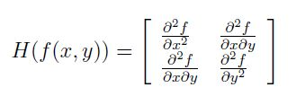    

​     即每一个像素点都可以求出一个Hessian矩阵。但是由于我们的特征点需要具备尺度无关性，所以在进行Hessian矩阵构造前，需要对其进行高斯滤波。这样，经过滤波后在进行Hessian的计算，其公式如下：

　　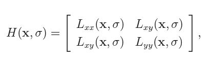 

​     公式中的符号，估计有点数学基础的朋友都能够猜到，这里就不多解释了。

​     最终我们要的是原图像的一个变换图像，因为我们要在这个变换图像上寻找特征点，然后将其位置反映射到原图中，例如在sift中，我们是在原图的DOG图上寻找特征点的。那么在surf中，这个变换图是什么呢？从surf的众多资料来看，就是原图每个像素的Hessian矩阵行列式的近似值构成的。其行列式近似公式如下：

　　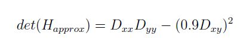    

​     其中0.9是作者给出的一个经验值，其实它是有一套理论计算的，具体去看surf的英文论文。

​     由于求Hessian时要先高斯平滑，然后求二阶导数，这在离散的像素点是用模板卷积形成的，这2中操作合在一起用一个模板代替就可以了，比如说y方向上的模板如下：

　　　　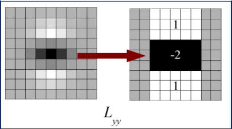    

​     该图的左边即用高斯平滑然后在y方向上求二阶导数的模板，为了加快运算用了近似处理，其处理结果如右图所示，这样就简化了很多。并且右图可以采用积分图来运算，大大的加快了速度，关于积分图的介绍，可以去查阅相关的资料。

​     同理，x和y方向的二阶混合偏导模板如下所示：

　　　　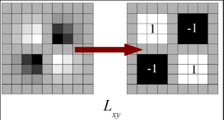

 

　　上面讲的这么多只是得到了一张近似hessian行列式图，这例比sift中的DOG图，但是在金字塔图像中分为很多层，每一层叫做一个octave，每一个octave中又有几张尺度不同的图片。在sift算法中，同一个octave层中的图片尺寸(即大小)相同，但是尺度(即模糊程度)不同，而不同的octave层中的图片尺寸大小也不相同，因为它是由上一层图片降采样得到的。在进行高斯模糊时，sift的高斯模板大小是始终不变的，只是在不同的octave之间改变图片的大小。而在surf中，图片的大小是一直不变的，不同的octave层得到的待检测图片是改变高斯模糊尺寸大小得到的，当然了，同一个octave中个的图片用到的高斯模板尺度也不同。Surf采用这种方法节省了降采样过程，其处理速度自然也就提上去了。其金字塔图像如下所示：

　　

　　　　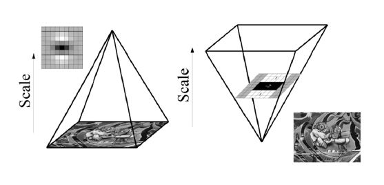

## **2. 利用非极大值抑制初步确定特征点**

　　此步骤和sift类似，将经过hessian矩阵处理过的每个像素点与其3维领域的26个点进行大小比较，如果它是这26个点中的最大值或者最小值，则保留下来，当做初步的特征点。

 

## **3. 精确定位极值点**

　　这里也和sift算法中的类似，采用3维线性插值法得到亚像素级的特征点，同时也去掉那些值小于一定阈值的点。

 

## **4. 选取特征点的主方向**

　　这一步与sift也大有不同。Sift选取特征点主方向是采用在特征点领域内统计其梯度直方图，取直方图bin值最大的以及超过最大bin值80%的那些方向做为特征点的主方向。而在surf中，不统计其梯度直方图，而是统计特征点领域内的harr小波特征。即在特征点的领域(比如说，半径为6s的圆内，s为该点所在的尺度)内，统计60度扇形内所有点的水平haar小波特征和垂直haar小波特征总和，haar小波的尺寸变长为4s，这样一个扇形得到了一个值。然后60度扇形以一定间隔进行旋转，最后将最大值那个扇形的方向作为该特征点的主方向。该过程的示意图如下：

　　　　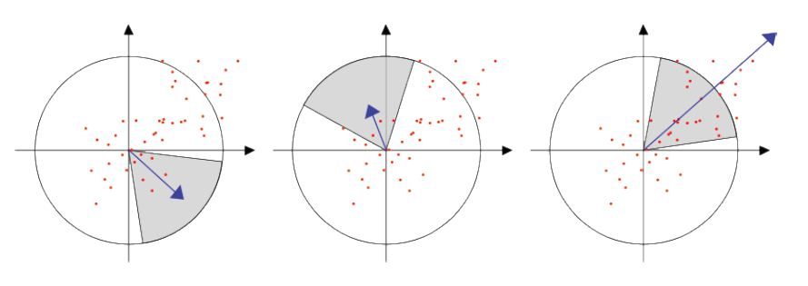

 

## **5. 构造surf特征点描述算子**

　　在sift中，是在特征点周围取16*16的邻域，并把该领域化为4*4个的小区域，每个小区域统计8个方向梯度，最后得到4*4*8=128维的向量，该向量作为该点的sift描述子。

　　在surf中，也是在特征点周围取一个正方形框，框的边长为20s(s是所检测到该特征点所在的尺度)。该框带方向，方向当然就是第4步检测出来的主方向了。然后把该框分为16个子区域，每个子区域统计25个像素的水平方向和垂直方向的haar小波特征，这里的水平和垂直方向都是相对主方向而言的。该haar小波特征为水平方向值之和，水平方向绝对值之和，垂直方向之和，垂直方向绝对值之和。该过程的示意图如下所示：

　　　　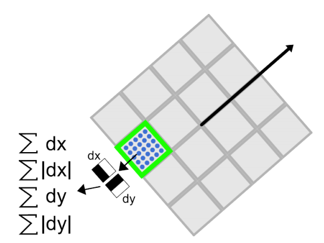

 

　　这样每个小区域就有4个值，所以每个特征点就是16*4=64维的向量，相比sift而言，少了一半，这在特征匹配过程中会大大加快匹配速度。

 

 

# **二、特征点的匹配过程**

　　surf特征点的匹配过程和sift类似，这里不做详细介绍

 

 

# **三、实验部分**

　　本次实验采用网上流行的open surf，用c++完成的，用到了opencv库，下载地址为：http://www.chrisevansdev.com/computer-vision-opensurf.html

　　该代码的作者给出的主函数实现了6中功能，包括静态图片特征点的检测，视频中特征点的检测，图片之间的匹配，视频与图片之间的匹配，特征点聚类等6中功能。本次实验就简单的测试了图片的检测，匹配和特征点聚类3个功能。并加入了简单的界面。

　　开发环境为：opencv2.4.2+Qt4.8.2+open surf+windosxp

　　实验分为下面3个部分来描述。

 

## ***Surf特征点检测和描述***

　　打开软件，单击Open Image按钮，选择一张待检测的图片，效果如下：

　　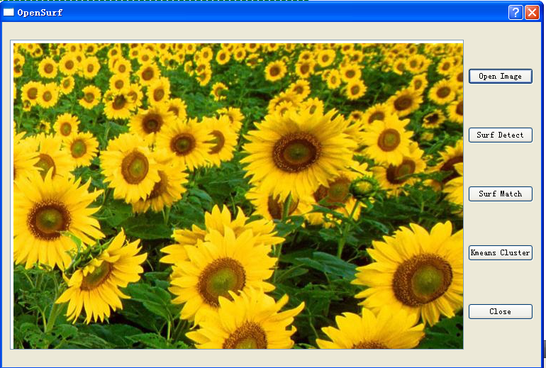

 

　　单击Surf Detect按钮，程序会对该图片进行特征点检测，并显示特征结果，包括特征点的主方向，尺度等信息。效果如下：

　　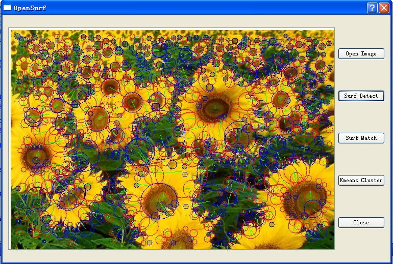

　　单击Close 按钮退出程序。

 

## ***Surf特征点匹配***

　　打开软件，单击Open Image 按钮，依次打开2幅待匹配的图片，这2幅图片要有相同的内容，只是尺度，旋转，光照等不同。打开图片后如下：

　　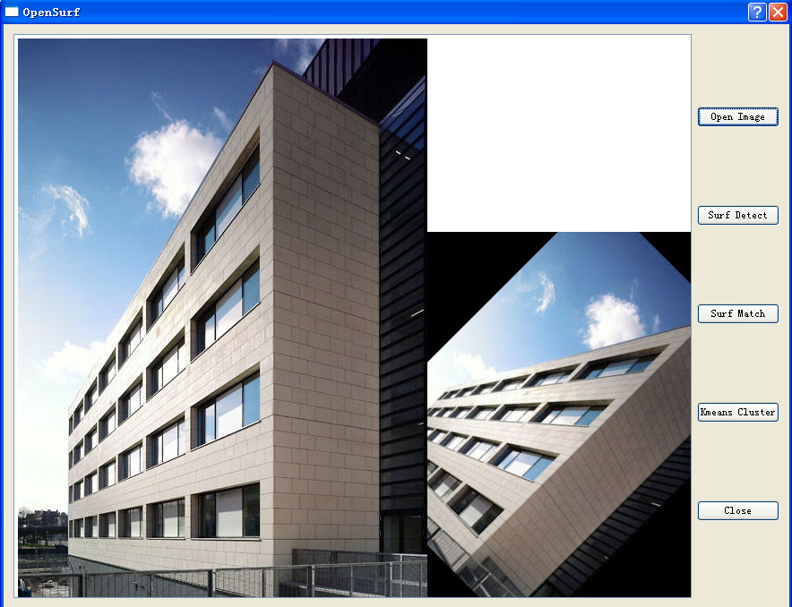

 

　　单击Surf Detect按钮，和上面类似，会先对图片进行检测，效果如下：

　　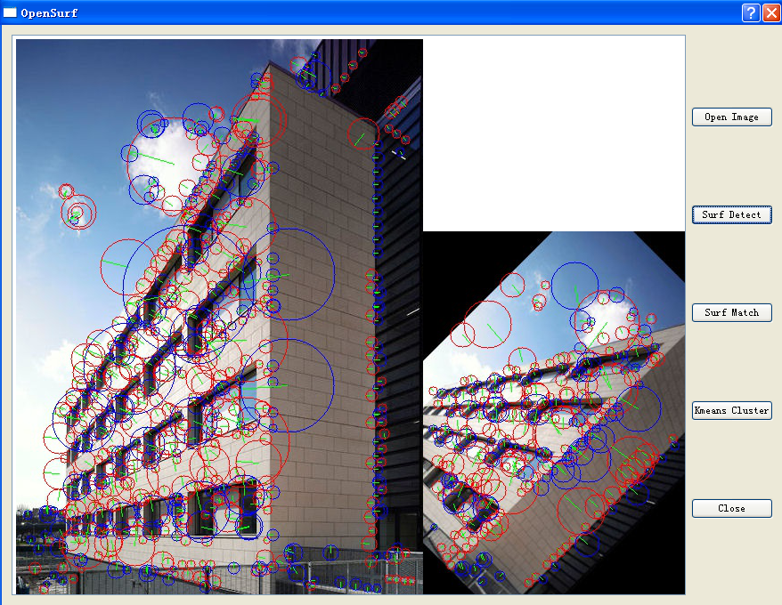

 

　　单击Surf Match 按钮，程序会对检测到的图片进行特征点匹配，效果如下：

　　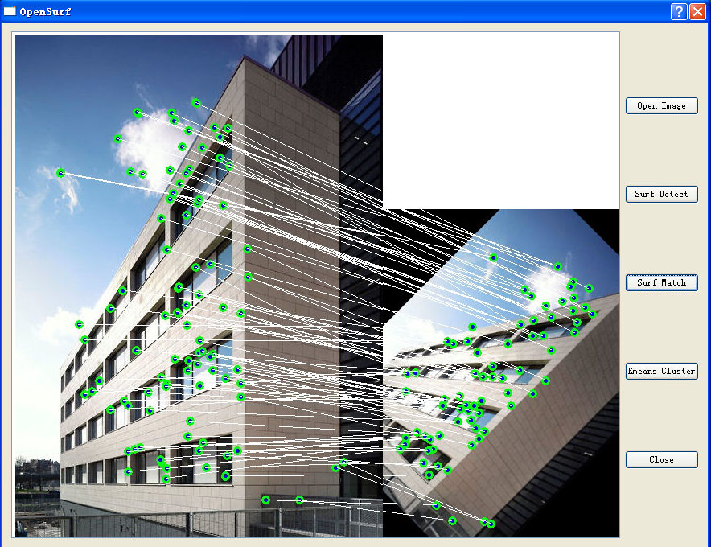

　　单击Close 按钮退出程序。

 

## ***Surf特征点聚类***

　　打开软件，单击Open Image 按钮，选择一张待特征点分类的图片，如下所示：

　　

 

　　单击Surf Detect按钮，首先对该图片进行surf特征点检测，如下：

　　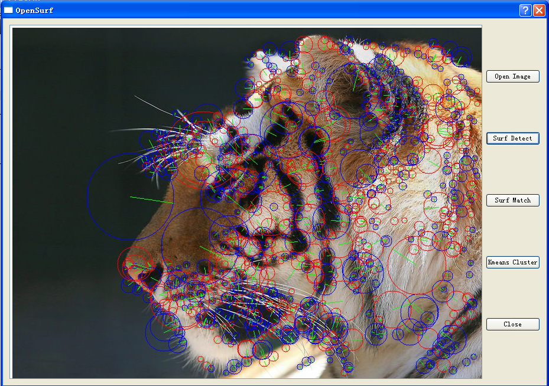

 

　　单击Kmeans Cluster按钮，程序会对这些特征点集合进行聚类，并显示其结果，如下所示：

　　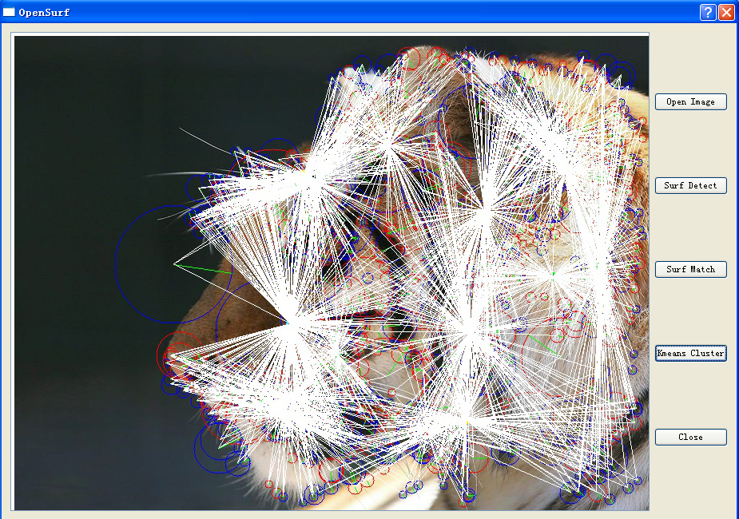

  单击Close 按钮退出程序。

 　

# **实验主要函数部分及代码**

（附录有工程code下载链接）：

***opensurf.h:\***

[](javascript:void(0);)

```c++
#ifndef OPENSURF_H
#define OPENSURF_H

#include <QDialog>
#include <opencv2/core/core.hpp>
#include <opencv2/highgui/highgui.hpp>
#include <opencv2/imgproc/imgproc.hpp>
#include <opencv2/calib3d/calib3d.hpp>
#include "ipoint.h"
#include "kmeans.h"

using namespace cv;

namespace Ui {
class OpenSurf;
}

class OpenSurf : public QDialog
{
    Q_OBJECT
    
public:
    explicit OpenSurf(QWidget *parent = 0);
    ~OpenSurf();
    
private slots:
    void on_openButton_clicked();

    void on_detectButton_clicked();

    void on_matchButton_clicked();

    void on_closeButton_clicked();

    void on_clusterButton_clicked();

private:
    Ui::OpenSurf *ui;
    IplImage *img1, *img2, *img_match1, *img_match2;
    IpVec ipts, ipts1, ipts2;
    IpPairVec matches;
    Kmeans km;
    int open_image_num;

};

#endif // OPENSURF_H
```

[](javascript:void(0);)

 

***opensurf.cpp:***

[](javascript:void(0);)

```c++
#include "opensurf.h"
#include "ui_opensurf.h"
#include <QtGui>
#include <QtCore>
#include "surflib.h"

using namespace std;

OpenSurf::OpenSurf(QWidget *parent) :
    QDialog(parent),
    ui(new Ui::OpenSurf)
{
    open_image_num = 0;
    ui->setupUi(this);
}

OpenSurf::~OpenSurf()
{
    delete ui;
}

void OpenSurf::on_openButton_clicked()
{
    QString img_name = QFileDialog::getOpenFileName(this, "Open Image", "../open_surf",
                                                           tr("Image Files(*.png *.jpeg *.jpg *.bmp)"));
       if(0 == open_image_num)
           ui->textBrowser->clear();
       open_image_num ++;
       if( 1 == open_image_num )
           {
               img1 = cvLoadImage(img_name.toAscii().data());
               img_match1 = cvLoadImage(img_name.toAscii().data());
               cvSaveImage("../open_surf/load_img1.jpg", img1);
               ui->textBrowser->setFixedSize(img1->width, img1->height);
               ui->textBrowser->insertHtml("");
           }
       else if(2 == open_image_num)
           {
               img2 = cvLoadImage(img_name.toAscii().data());
               img_match2 = cvLoadImage(img_name.toAscii().data());
               cvSaveImage("../open_surf/load_img2.jpg", img2);
               ui->textBrowser->setFixedSize(img1->width+img2->width, std::max(img1->height, img2->height));
               //取消自动换行模式，让2幅图片水平显示
               ui->textBrowser->setWordWrapMode (QTextOption::NoWrap);
               ui->textBrowser->insertHtml("");
           }
       else if(3 == open_image_num)
           {
               open_image_num = 0;
               ui->textBrowser->clear();
           }
}

void OpenSurf::on_detectButton_clicked()
{
    if( 1 == open_image_num )
        {
            //用surf对特征点进行检测
            surfDetDes(img1, ipts, false, 5, 4, 2, 0.0004f);
            //在图像中将特征点画出来
            drawIpoints(img1, ipts);
            cvSaveImage("../open_surf/detect_img1.jpg", img1);
            ui->textBrowser->clear();
            ui->textBrowser->setFixedSize(img1->width, img1->height);
            ui->textBrowser->insertHtml("");
        }
    else if (2 == open_image_num)
        {
            //用surf对特征点进行检测
            surfDetDes(img1, ipts1, false, 5, 4, 2, 0.0004f);
            //在图像中将特征点画出来
            drawIpoints(img1, ipts1);
            cvSaveImage("../open_surf/detect_img1.jpg", img1);
            //用surf对特征点进行检测
            surfDetDes(img2, ipts2, false, 5, 4, 2, 0.0004f);
            //在图像中将特征点画出来
            drawIpoints(img2, ipts2);
            cvSaveImage("../open_surf/detect_img2.jpg", img2);
            ui->textBrowser->clear();
            ui->textBrowser->insertHtml("");

            ui->textBrowser->setFixedSize(img1->width+img2->width, std::max(img1->height, img2->height));
            //取消自动换行模式，让2幅图片水平显示
            ui->textBrowser->setWordWrapMode (QTextOption::NoWrap);
            ui->textBrowser->insertHtml("");
        }
}

void OpenSurf::on_matchButton_clicked()
{
    if(2 == open_image_num)
        {
            getMatches(ipts1,ipts2,matches);
            for (unsigned int i = 0; i < matches.size(); ++i)
              {
                drawPoint(img_match1,matches[i].first);
                drawPoint(img_match2,matches[i].second);

                const int & w = img1->width;
                const int & h1 = img1->height;
                const int & h2 = img2->height;
                //这里因为我事先已经知道了图片的相对打开后显示的位置，所以在画匹配的直线时加了点常识
                //因此该方法不通用，只是适合本例中给的图片，最好的方法就像Rob Hess的sift算法那样
                //把2张图片合成一张，然后在一张图片上画匹配直线
                cvLine(img_match1,cvPoint(matches[i].first.x,matches[i].first.y),
                       cvPoint(matches[i].second.x+w,matches[i].second.y+std::abs(h1-h2)),
                       cvScalar(255,255,255),1);
                cvLine(img_match2,cvPoint(matches[i].first.x-w,matches[i].first.y-std::abs(h1-h2)),
                       cvPoint(matches[i].second.x,matches[i].second.y),
                       cvScalar(255,255,255),1);
              }
            cvSaveImage("../open_surf/match_img1.jpg", img_match1);
            cvSaveImage("../open_surf/match_img2.jpg", img_match2);
            ui->textBrowser->clear();
            ui->textBrowser->insertHtml("");

            ui->textBrowser->setFixedSize(img1->width+img2->width, std::max(img1->height, img2->height));
            //取消自动换行模式，让2幅图片水平显示
            ui->textBrowser->setWordWrapMode (QTextOption::NoWrap);
            ui->textBrowser->insertHtml("");
        }
}


void OpenSurf::on_clusterButton_clicked()
{
    for (int repeat = 0; repeat < 10; ++repeat)
      {

        km.Run(&ipts, 5, true);
        drawPoints(img1, km.clusters);

        for (unsigned int i = 0; i < ipts.size(); ++i)
        {
          cvLine(img1, cvPoint(ipts[i].x,ipts[i].y), cvPoint(km.clusters[ipts[i].clusterIndex].x ,km.clusters[ipts[i].clusterIndex].y),cvScalar(255,255,255));
        }
        cvSaveImage("../open_surf/kmeans_img1.jpg", img1);
        ui->textBrowser->clear();
        ui->textBrowser->setFixedSize(img1->width, img1->height);
        ui->textBrowser->insertHtml("");
      }
}


void OpenSurf::on_closeButton_clicked()
{
    close();
}
```

[](javascript:void(0);)

 

 　

# **总结：**

   Surf在速度上比sift要快许多，这主要得益于它的积分图技术，已经Hessian矩阵的利用减少了降采样过程，另外它得到的特征向量维数也比较少，有利于更快的进行特征点匹配。

 

#  **附录一：**

　　1、和RobHesson运行时一样，这里的open surf运行时出现如下错误：

　　ipoint.obj:-1: error: LNK2019: 无法解析的外部符号 _cvFindHomography，该符号在函数 "int __cdecl translateCorners(class std::vector<struct std::pair<class Ipoint,class Ipoint>,class std::allocator<struct std::pair<class Ipoint,class Ipoint> > > &,struct CvPoint const * const,struct CvPoint * const)" (?translateCorners@@YAHAAV?$vector@U?$pair@VIpoint@@V1@@std@@V?$allocator@U?$pair@VIpoint@@V1@@std@@@2@@std@@QBUCvPoint@@QAU3@@Z) 中被引用

　　不过这次的原因是没有opencv_calib3d242d.lib库，因为本open surf在进行特征匹配时用到了opencv中的3维重建有关的函数cvFindHomography(该函数是求2个图像间的单应矩阵)，所以很多人都会忘了添加这个库文件，就会导致这个错误。

 

　　2、如果用了Qt或MFC等界面设计代码时，编译该程序会报如下错误：

　　moc_open_surf.obj:-1: error: LNK2005: "public: void __thiscall Kmeans::SetIpoints(class std::vector<class Ipoint,class std::allocator<class Ipoint> > *)" (?SetIpoints@Kmeans@@QAEXPAV?$vector@VIpoint@@V?$allocator@VIpoint@@@std@@@std@@@Z) 已经在 main.obj 中定义

　　其实是Open Surf的作者可能没有考虑周全，它在kmeans.h文件中把Kmeans这个类的成员函数方法在头文件中实现了，其实这在标准c++中是不支持的。解决方法就是把kmeans.h改造成kemans.hpp(该方法我没有去试过)；另外一种方法就是新建一个kmeans.cpp文件，把成员函数的实现过程放在cpp文件中实现，我这次试验就是采用的这个方法。

 

#  **附录二：**

　　[实验工程code下载](http://www.pudn.com/downloads469/sourcecode/graph/opencv/detail1969262.html)。

 

 

 

作者：tornadomeet 出处：http://www.cnblogs.com/tornadomeet 欢迎转载或分享，但请务必声明文章出处。      （新浪微博：tornadomeet,欢迎交流！）